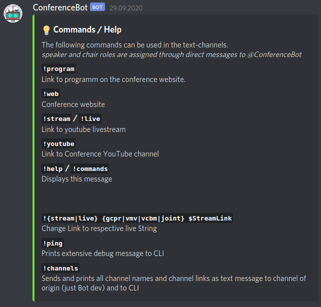

ConferenceBot - the hacky Conference Bot
===

Build and tailored to the needs of [GCPR VMV VCBM 2020](gcpr-vmv-vcbm-2020.uni-tuebingen.de).
Those were primarily providing role assignment to speakers and chairs. For more information on the overall conference organization have a look into the [guideline document](https://github.com/DAGM-GCPR-VMV-VCBM-2020/ConferenceBot/blob/main/conference-media-guide_generic_v01.pdf).

# Requirements
A machine running both Java and Gradle. Preferably the latest version of both.

# Setup
This Bot uses both a [Discord API](https://github.com/DV8FromTheWorld/JDA) and the [GoogleSheet API](
https://developers.google.com/sheets/api/quickstart/java).

Setup your Bot on the [Discord Developer Portal](https://discord.com/developers/applications) and get your **BOT_TOKEN**.

Regarding the Google Sheet part. 
Follow the official Java [Quickstart Guide](https://developers.google.com/sheets/api/quickstart/java) as the class `SheetImport.java` is basically the same file.
And put your Credentials in the `credentials.json`.

## Settings
All Settings are contained in the `Settings.java` class. (In hindsight not the smartest way of handling Settings)
Put your *Website, Name, Youtube links, etc.* in there.

The needed Discord IDs can be found out by running the `!ping` command in one of the channels. 
It puts a lot of information to the command line. Including the needed IDs.

For the Google Sheet section. Make sure your Sheet Id is in there and the Sheet layout is like:

| ID | Password | First Name | Last Name | ... |
|----|----------|------------|-----------|-----|
| 42 | PW       | Bobby      | Tables    | ... |


# Run
## Gradle
```
export BOT_TOKEN=<Token>
gradle run
```

## Jar
Build a Jar using `gradle shadowJar`
```
export BOT_TOKEN=<Token>
java -jar build/libs/ConBot-1.0-SNAPSHOT-all.jar
```

# Features
## Role Assignment
Upon Joining a Server a Welcome message is sent.
The user can reply with `!speaker PW` or `!chair PW` depending on the desired role.

Manual assignment through `!role @UserX @UserY @RoleA @RoleB`

## Other

